# Nash platform localization files


This is an open repository for the community to help translate and correct Nash locale files.

Locale files are in JSON format and organized like this:

```javascript
{
  "key": "content"
}
```

Here "key" is the keyword used in the platform code to identify the text and should not be modified. The "content" text is the translation target and is what replaces occurences of "key" in the code.

There are some coding specifics in certain keys. These are indentified by `{{}}`,  e.g. `Hello, {{userName}}!`, and should be kept as they are. Only translate the text around these elements and move them to match appropriate word order in your language.

You will also notice links denoted by numbered tags, e.g. `View your transaction under the <0>Transfers</0> tab.` In this case, you should translate the text within the tags.

## Using GitHub

The process is slightly different depending on whether your language is already activated ("live") on Nash or not.

To find that out, check [translations.nash.io](https://translations.nash.io):
<p align="center">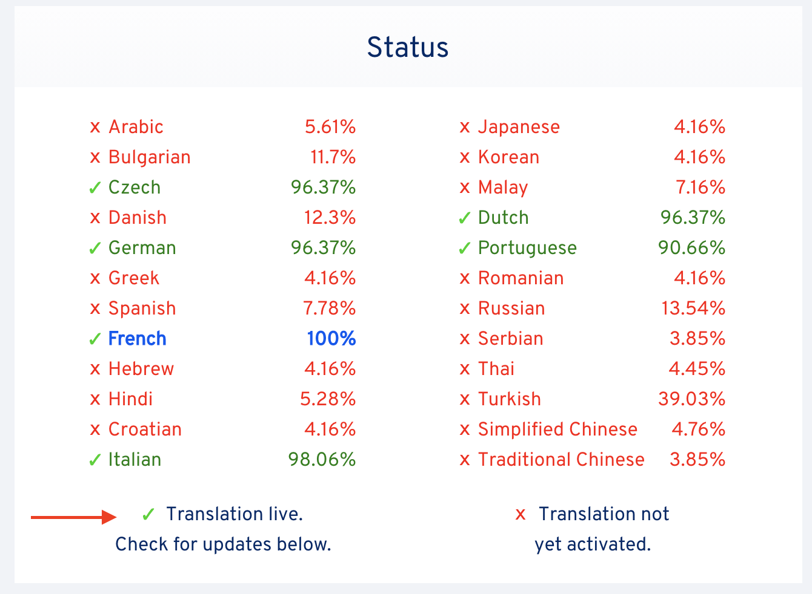</p>

If you want to *correct* an existing translation, rather than translate an update, follow the first guide here.

### If your language is not yet activated (or you want to make a correction):

1) Click the link to the file for your language in the list below. 
<p align="center">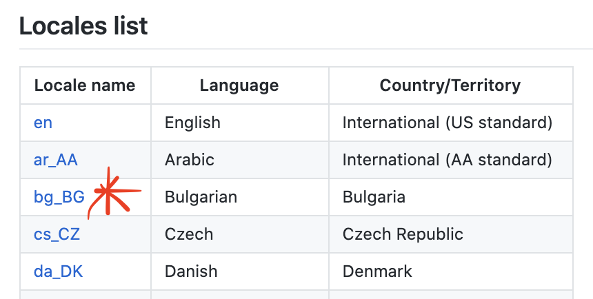</p>

2) Click the "Edit file" button.
<p align="center">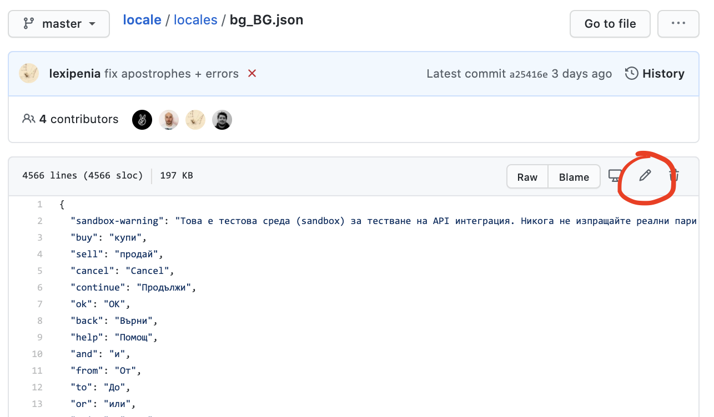</p>

3) Make your changes (i.e. translate some lines) and click the "Propose changes" button at the bottom.
<p align="center">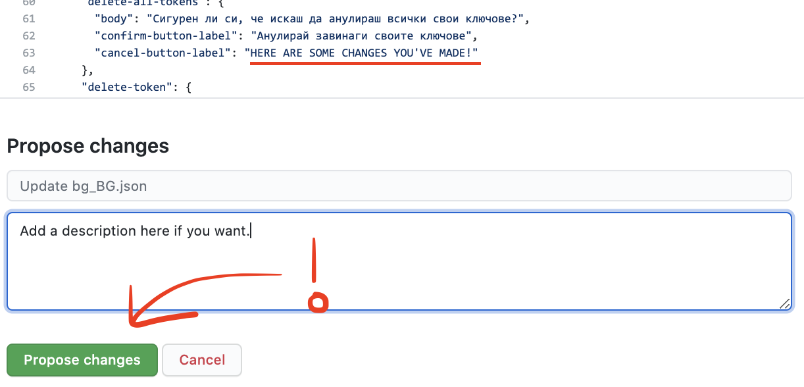</p>

4) Press the "Create pull request" button.
<p align="center">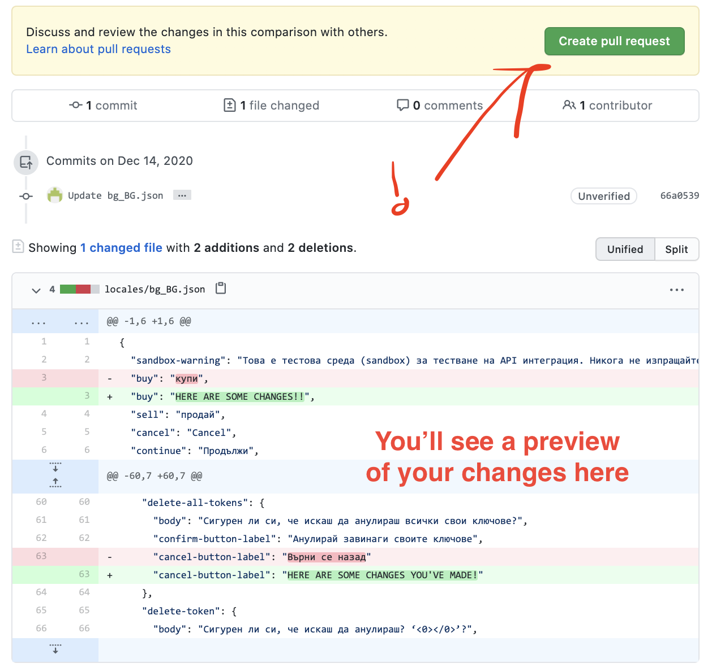</p>

5) Press "Create pull request" one more time on the next screen.
<p align="center">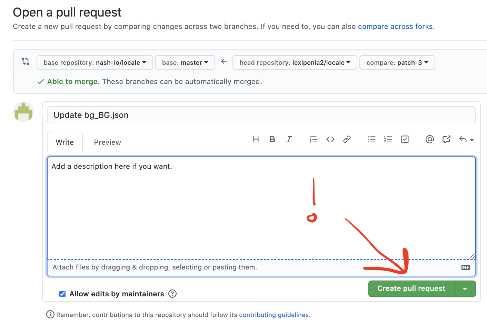</p>

That's it! You're done. We'll merge in your changes as soon as possible.
<br>

### If your language is activated ("live") and you want to translate updates:

1) Look for a translation update on [translations.nash.io](https://translations.nash.io) and click the "Edit and add" link next to it.
<p align="center">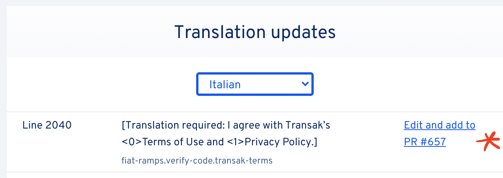</p>

2) You will be taken to a copy of your language file where these translations are marked `Translation required`. The link will take you to the exact line that you clicked on.
<p align="center">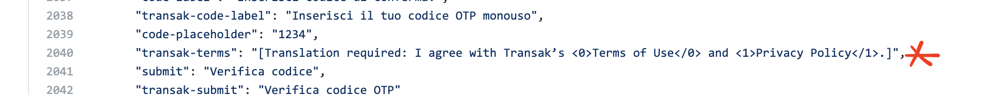</p>

3) You can find other lines that need translating in this copy of the file by searching for `Translation required`. Doing multiple lines at once will be faster than making each change individually.
<p align="center">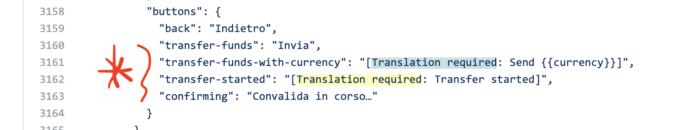</p>

4) Write your translations into the file, removing the surrounding `[]` and `Translation required` tags. Then click "Propose changes" at the bottom of the page. 
<p align="center">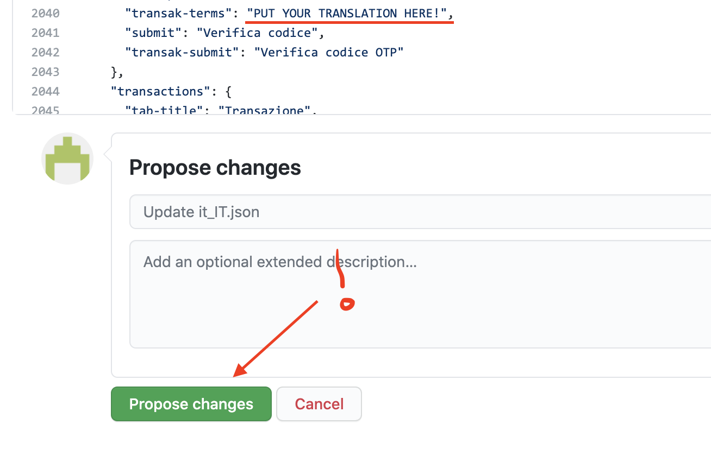</p>

5) Click the "Create pull request" button on the next screen. **Do not change any of the settings here!** The `base` branch your pull request is going to should always have a name like `it_IT.json-2020-11-23-18-41-16`. 
<p align="center">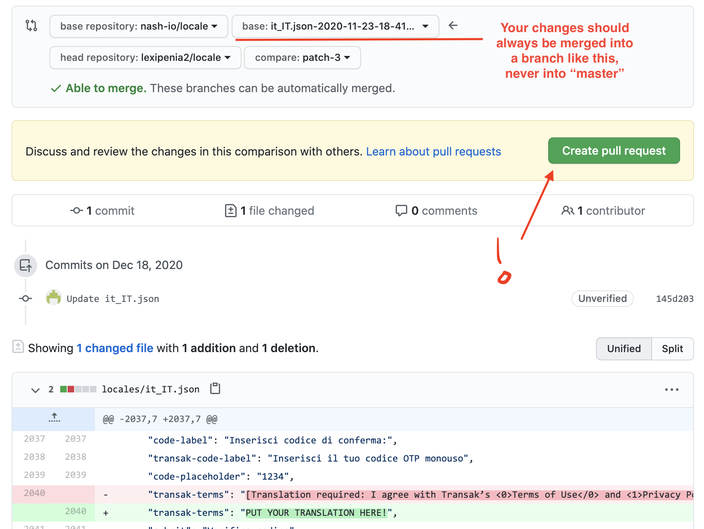</p>

6) Press "Create pull request" one more time on the next screen.
<p align="center">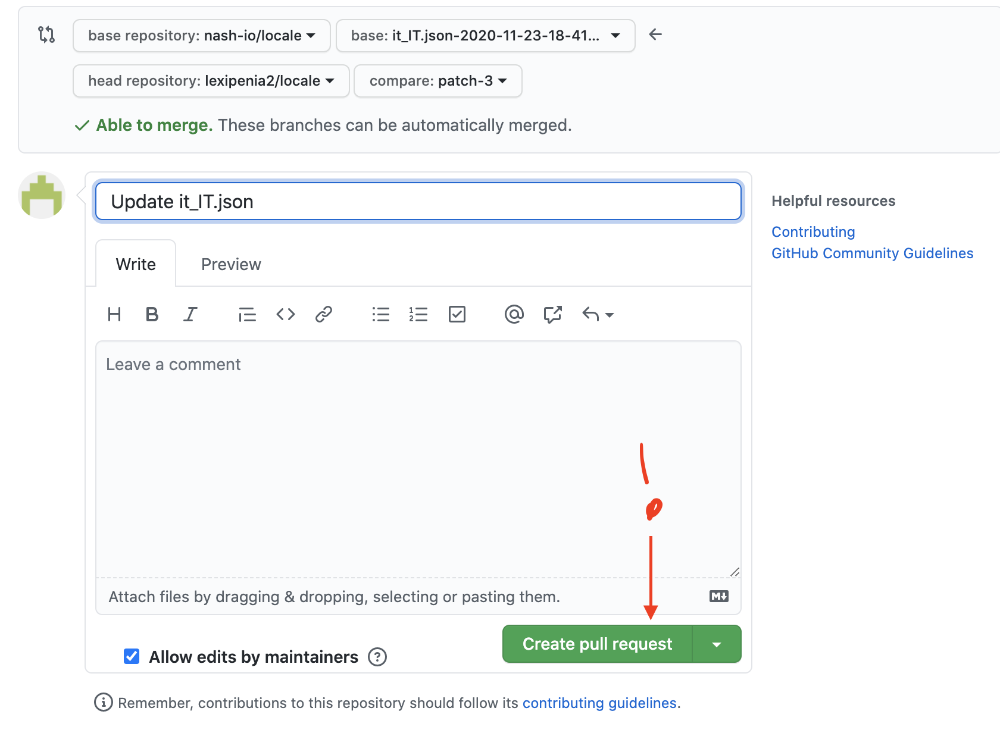</p>

That's it! You're done. We'll merge in your changes as soon as possible.

### Video tutorial
Never used GitHub? This is the easiest way to contribute:
https://www.youtube.com/watch?v=5u0I0UX81tI

### Desktop app
If you are facing issues using GitHub for the first time there is a desktop app that might make your life easier: https://desktop.github.com/

## Tips for contributors

1) Make multiple sets of small changes. Keep your pull requests to 100 lines at most.
2) Always ensure you are making changes against the latest version of the `master` branch.

You can view our simple contributions policy [here](./CONTRIBUTING.md).

## Ask for help!

If you don't understand a phrase in the English file, don't guess! Ask for help. Our writer is available on GitHub as `@lexipenia` and Telegram as `@cstfenwick` and will be able to clarify issues for you.

## Locales list

| Locale name | Language           | Country/Territory           |
|-------------|--------------------|-----------------------------|
| [en](./locales/en.json)             | English            | International (US standard) |
| [ar_AA](./locales/ar_AA.json)       | Arabic             | International (AA standard) |
| [bg_BG](./locales/bg_BG.json)       | Bulgarian          | Bulgaria                    |
| [cs_CZ](./locales/cs_CZ.json)       | Czech              | Czech Republic              |
| [da_DK](./locales/da_DK.json)       | Danish             | Denmark                     |
| [de_DE](./locales/de_DE.json)       | German             | International (DE standard) |
| [el_GR](./locales/el_GR.json)       | Greek              | Greece                      |
| [es_ES](./locales/es_ES.json)       | Spanish            | International (ES standard) |
| [fr_FR](./locales/fr_FR.json)       | French             | International (FR standard) |
| [he_IL](./locales/he_IL.json)       | Hebrew             | Israel                      |
| [hi_IN](./locales/hi_IN.json)       | Hindi              | Hindi                       |
| [hr_HR](./locales/hr_HR.json)       | Croatian           | Croatia                     |
| [it_IT](./locales/it_IT.json)       | Italian            | Italy                       |
| [ja_JP](./locales/ja_JP.json)       | Japanese           | Japan                       |
| [ko_KR](./locales/ko_KR.json)       | Korean             | Korea                       |
| [ms_MY](./locales/ms_MY.json)       | Malay              | International (MY standard) |
| [nl_NL](./locales/nl_NL.json)       | Dutch              | Netherlands and Belgium     |
| [pt_BR](./locales/pt_BR.json)       | Portuguese         | International (BR standard) |
| [ro_RO](./locales/ro-RO.json)       | Romanian           | Romania                     |
| [ru_RU](./locales/ru_RU.json)       | Russian            | Russia                      |
| [sr_RS](./locales/sr_RS.json)       | Serbian            | Serbia                      |
| [th_TH](./locales/th-TH.json)       | Thai               | Thailand                    |
| [tr_TR](./locales/tr_TR.json)       | Turkish            | Turkey                      |
| [zh_CN](./locales/zh_CN.json)       | Simplified Chinese | International (CN standard) |
| [zh_TW](./locales/zh_TW.json)       | Traditional Chinese| International (TW standard) |
